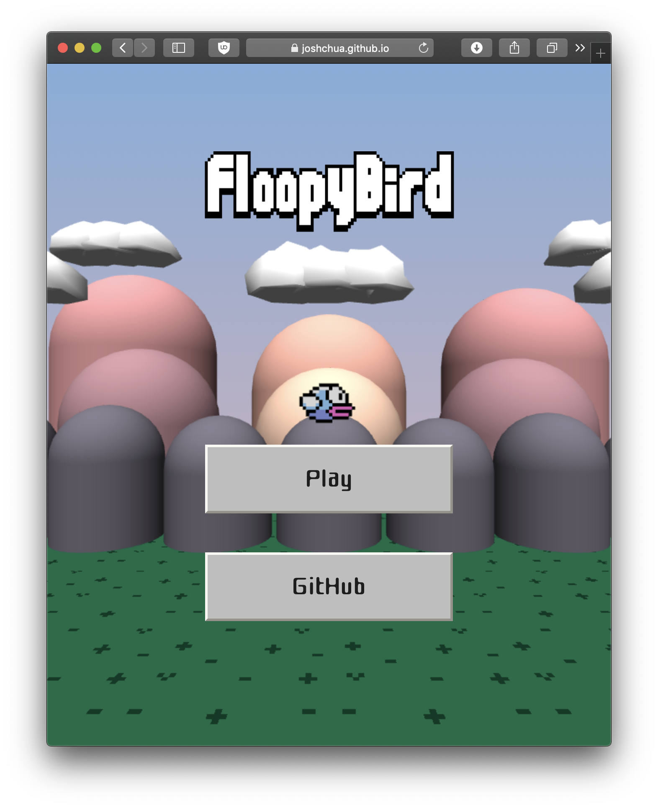

# Floopy Bird

## Introduction

Floopy Bird is a 3D, first-person remake of Dong Nguyen's 2013 hit mobile game, Flappy Bird. Floopy Bird is playable on any modern browser. To play, press a key on the keyboard, click, or tap the screen to make Floopy Bird fly.

Floopy Bird was created as my final project for CIS 367 Computer Graphics at Grand Valley State University taken during the Winter 18-19 semester. The project task was to create "A Simple Interactive 3D Game". For this project, Three.js was used for graphics rendering and Tween.js was used for tweening animations of the 3D objects.

At the time of creating this game, I read a lot about ReactiveX and reactive programming, so I attempted to use RXJS for this project. This project is split into two parts: graphics and game logic. For the game logic portion, I used functional and reactive programming that would output a GameState observable stream, and then the renderer would subscribe to this GameState object, interpret it, and render.
